# 经销商订单收款平台 - 业务逻辑系统思维导图

> 基于《API接口文档 V1.2》、《技术方案设计文档 V1.0》、《核心数据库结构设计(Prisma)》三份文档综合整理更新。
> 采用"左右横向拓扑树 (Flowchart LR)"以清晰呈现三端 + 后端支撑层的完整业务脉络。

---

## 一、系统三端 + 后端支撑层结构图

```mermaid
graph LR
  System[经销商订单收款平台<br/>多租户SaaS架构]

  %% ========== C端 H5 付款页 ==========
  System ===> H5[1. C端 买家扫码付款H5<br/>apps/pay-h5]

  H5 --> H5_Entry[物理触达链路]
  H5_Entry --> H5_E1(打单员在Tenant端打印带付款码发货单<br/>司机随车送货并将单据交给超市老板)
  H5_Entry --> H5_E2(超市老板货到后扫描小票付款码)

  H5 --> H5_State{GET /pay/:token<br/>校验 qrCodeToken<br/>查订单当前状态}
  H5_State -- UNPAID --> H5_Unpaid[展示商品摘要与应付金额<br/>显示【立即支付】按钮]
  H5_Unpaid --> H5_Initiate(POST /pay/:token/initiate<br/>金额由后端定格 前端无权传入<br/>订单状态置为 PAYING 防并发)
  H5_Initiate --> H5_Lakala(跳转拉卡拉原生收银页<br/>买家完成扫码/输密码支付)
  H5_Lakala --> H5_Return(返回H5页面<br/>GET /pay/:token/status 主动轮询<br/>后端同步向拉卡拉确认结果)
  H5_State -- PAID --> H5_Paid(霸屏大绿标「已付款」<br/>彻底阻断重复支付)
  H5_State -- PAYING --> H5_Paying(Loading状态展示<br/>code=1003 防止重复点击)
  H5_State -- Token已过期 --> H5_Expired(code=1002 二维码已过期<br/>引导联系经销商重新获取)

  H5 --> H5_QR[二维码安全管控]
  H5_QR --> H5_QR1(qrExpireAt 由后端读取生单时间计算<br/>超过配置阈值默认90天后强制拦截)
  H5_QR --> H5_QR2(前端无法绕过后端有效期校验)
  H5_QR --> H5_QR3(qrCodeToken 唯一Hash短串<br/>不可猜测 不可伪造)

  H5 --> H5_Dual[支付结果双链路保障<br/>确保零掉单]
  H5_Dual --> H5_D1(被动：拉卡拉 Webhook 回调<br/>POST /payment/webhook/lakala<br/>后端验签后写入支付流水+更新订单<br/>channelTradeNo 唯一约束防重复入账)
  H5_Dual --> H5_D2(主动：H5重新获焦触发轮询<br/>GET /pay/:token/status<br/>后端同步向拉卡拉查询<br/>Webhook丢包时兜底)

  %% ========== Tenant端 ==========
  System ===> Tenant[2. Tenant端 PC经销商工作台<br/>apps/tenant]

  Tenant --> T_Auth[身份认证与角色权限]
  T_Auth --> T_A1(POST /auth/login<br/>需传 tenantId 区分租户上下文)
  T_Auth --> T_A2(硬编码4个预设角色 不提供动态自建<br/>前端按角色枚举做条件渲染)
  T_A2 --> T_R1(TENANT_OWNER 老板<br/>全部模块 + 员工管理)
  T_A2 --> T_R2(TENANT_OPERATOR 打单员<br/>导入 + 订单管理 + 打印)
  T_A2 --> T_R3(TENANT_FINANCE 出纳<br/>财务报表只读 + 站内信)
  T_A2 --> T_R4(TENANT_VIEWER 只读<br/>订单列表 + 财务报表只读)

  Tenant --> T_Import[Excel智能导入模块]
  T_Import --> T_I1(SheetJS 浏览器端解析Excel<br/>不上传原始文件到服务端)
  T_Import --> T_I2(可视化拖拽列映射设计器<br/>首次手动建立字段对应关系)
  T_Import --> T_I3(模板管理 CRUD<br/>GET/POST/PATCH/DELETE /import/templates<br/>mappingRules 标准字段映射持久化<br/>customFieldDefs 自定义字段定义持久化)
  T_Import --> T_I3B(自定义字段定义 customFieldDefs<br/>声明额外列：columnHeader+fieldKey+label+showInList<br/>浏览器端解析时同步提取 写入 order.customFields)
  T_Import --> T_I4(POST /import/preview<br/>服务端校验重复单号+金额合法性<br/>返回校验报告供用户确认)
  T_Import --> T_I5(POST /orders/import<br/>提交校验通过的JSON数据<br/>BullMQ 异步队列入库 返回 jobId)
  T_Import --> T_I6(GET /orders/import/jobs/:jobId<br/>轮询导入进度<br/>PENDING→PROCESSING→COMPLETED)

  Tenant --> T_Order[订单管理]
  T_Order --> T_OL(GET /orders<br/>多维筛选：payStatus/deliveryStatus<br/>关键词/模板/日期/creditExpiring账期临期<br/>按 templateId 筛选时响应附带 templateCustomFields<br/>前端据此动态渲染自定义列头)
  T_Order --> T_OD(GET /orders/:id<br/>含商品明细 items<br/>支付流水 payments<br/>操作日志 logs<br/>自定义扩展字段 customFields)
  T_Order --> T_OQ(GET /orders/:id/qrcode<br/>获取付款码URL用于打印发货单)
  T_Order --> T_Discount(PATCH /orders/:id/discount<br/>改价：只写 discountAmount<br/>totalAmount 生单后严禁修改<br/>恒等式：total = paid + discount<br/>自动写入操作流水快照)
  T_Order --> T_Manual(POST /orders/:id/manual-paid<br/>手工标记已支付<br/>适用于线下转账/现金场景<br/>partial付款→PARTIAL_PAID<br/>全额付清→PAID)
  T_Order --> T_Delivery(PATCH /orders/:id/delivery-status<br/>单向流转：PENDING已打单<br/>→ IN_TRANSIT已出车<br/>→ DELIVERED已送达)
  T_Order --> T_OSM{订单支付状态机}
  T_OSM --> T_OSM1(UNPAID 待支付)
  T_OSM --> T_OSM2(PAYING 支付中-防并发重复发起)
  T_OSM --> T_OSM3(PARTIAL_PAID 部分到账)
  T_OSM --> T_OSM4(PAID 全额收清)
  T_OSM --> T_OSM5(REFUNDED 已退款)

  Tenant --> T_Print[打印中心]
  T_Print --> T_P1(POST /print/jobs<br/>批量选单触发生成打印数据)
  T_Print --> T_PV1(浏览器 @media print 方案<br/>隐藏iframe 适配针式打印机纸张<br/>用户点击一次确认即可完成打印)

  Tenant --> T_Report[财务报表]
  T_Report --> T_R_Sum(GET /report/summary<br/>回款概览：总额/折扣额/未收额<br/>实收率/按送货人/按导入模板)
  T_Report --> T_R_Ord(GET /report/orders<br/>订单明细 支持 export=true 导出)
  T_Report --> T_R_Pay(GET /report/payments<br/>支付流水 可按<br/>ONLINE_PAYMENT/MANUAL_MARKUP 筛选)

  Tenant --> T_Notify[站内信中心]
  T_Notify --> T_N1(GET /notifications/unread-count<br/>顶部导航角标 建议30秒轮询)
  T_Notify --> T_N2(GET /notifications<br/>消息列表 支持已读/未读筛选)
  T_Notify --> T_N3(PATCH /notifications/:id/read<br/>标记单条已读)
  T_Notify --> T_N4(POST /notifications/read-all<br/>批量全部已读)
  T_Notify --> T_N5((触发来源：BullMQ每日凌晨定时任务<br/>多阶段推送 7天前/3天前/到期当天<br/>幂等锁：同一订单同一阶段只推一次<br/>收件人：OWNER + FINANCE 两角色))

  Tenant --> T_Settings[账期设置]
  T_Settings --> T_ST1(GET /tenant/settings 查看当前配置)
  T_Settings --> T_ST2(PATCH /tenant/settings<br/>maxCreditDays 最大账期天数<br/>仅影响新订单的creditExpireAt快照<br/>历史订单账期截止日不变)
  T_Settings --> T_ST3(creditReminderDays 提前提醒天数<br/>不得大于 maxCreditDays)
  T_Settings --> T_ST4(进件参数 paymentConfig 和<br/>SaaS到期 expireAt<br/>仅OS端可修改 租户无权变更)

  Tenant --> T_Staff[员工管理]
  T_Staff --> T_SF1(GET/POST /tenant/users<br/>列表查询+新建员工账号)
  T_Staff --> T_SF2(PATCH /tenant/users/:id<br/>修改 realName/role/password)
  T_Staff --> T_SF3(POST /tenant/users/:id/freeze<br/>POST /tenant/users/:id/unfreeze<br/>冻结后该员工登录返回403)

  %% ========== OS端 ==========
  System ===> OS[3. OS端 PC平台运营管理台<br/>apps/admin]

  OS --> O_User[OS账号管理]
  O_User --> O_U1(硬编码2个角色<br/>OS_SUPER_ADMIN / OS_OPERATOR)
  O_User --> O_U2(GET/POST /os/users 列表+新建)
  O_User --> O_U3(PATCH /os/users/:id 更新realName/password/role)
  O_User --> O_U4(POST /os/users/:id/disable 禁用账号)
  O_User --> O_U5(仅由超管手动创建 无自助注册流程)

  OS --> O_Tenant[商户租户管理]
  O_Tenant --> O_T1(GET /os/tenants 列表<br/>支持 keyword/status/agentId 筛选)
  O_Tenant --> O_T2(GET /os/tenants/:id 详情<br/>含 paymentConfig 进件公开参数)
  O_Tenant --> O_T3(POST /os/tenants 创建租户<br/>绑定拉卡拉进件参数 lakalaShopNo)
  O_Tenant --> O_T4(PATCH /os/tenants/:id<br/>修改基本信息+进件参数+账期配置+SaaS期限)
  O_Tenant --> O_T5(POST /os/tenants/:id/suspend 封禁<br/>POST /os/tenants/:id/restore 恢复<br/>封禁后该租户所有员工登录返回403)

  OS --> O_Agent[代理商管理]
  O_Agent --> O_AG1(GET/POST /os/agents<br/>列表查询+新建代理商档案)
  O_Agent --> O_AG2(PATCH /os/agents/:id<br/>修改名称/电话/commissionRate 佣金比例)
  O_Agent --> O_AG3(POST /os/agents/:id/disable<br/>POST /os/agents/:id/enable<br/>禁用后下属关联关系保留不影响租户)
  O_Agent --> O_AG4(BullMQ日结定时任务每日凌晨运行<br/>按 agentId+tenantId+settlementDate 唯一<br/>快照结算时佣金比例防止后续调整影响历史)

  OS --> O_Report[平台总报表]
  O_Report --> O_R1(GET /os/reports/platform<br/>按日期范围查询)
  O_Report --> O_R2(总收款额 / 总订单量<br/>活跃商户数 / 待结算佣金总额<br/>每日趋势走势图数据)

  %% ========== 后端支撑层 ==========
  System ===> Backend[4. 后端支撑层<br/>apps/api · NestJS]

  Backend --> B_Auth[认证授权]
  B_Auth --> B_A1(JWT双令牌机制<br/>Access Token 2小时<br/>Refresh Token 7天 HttpOnly Cookie)
  B_A1 --> B_A2(Redis黑名单管理<br/>POST /auth/logout 主动吊销)
  B_Auth --> B_A3(多租户行级隔离<br/>所有查询ORM层自动注入tenantId<br/>禁止跨租户数据访问)

  Backend --> B_Queue[BullMQ异步任务队列]
  B_Queue --> B_Q1(Excel批量导入队列<br/>防止大数据量冲垮数据库)
  B_Queue --> B_Q2(账期到期提醒定时任务<br/>每日凌晨扫描UNPAID/PARTIAL_PAID订单<br/>多阶段：7_DAYS_BEFORE / 3_DAYS_BEFORE / EXPIRE_DAY<br/>幂等锁：OrderCreditReminder唯一约束)
  B_Queue --> B_Q3(代理商佣金日结任务<br/>每日生成AgentCommissionLedger台账)
  B_Queue --> B_Q4(支付状态主动轮询任务调度)

  Backend --> B_Safety[支付安全机制]
  B_Safety --> B_S1(金额服务端定格<br/>C端发起支付前端无权传入金额参数)
  B_Safety --> B_S2(Redis分布式锁<br/>防同一订单并发重复发起支付)
  B_Safety --> B_S3(数据库乐观锁<br/>订单状态字段并发安全保障)
  B_Safety --> B_S4(channelTradeNo唯一约束<br/>物理层防Webhook重复入账)
  B_Safety --> B_S5(totalAmount生单后只读<br/>改价只写discountAmount<br/>三元恒等式 total=paid+discount)

  Backend --> B_Audit[全链路操作审计]
  B_Audit --> B_AU1(OrderLifecycleLog 只增不改不删<br/>覆盖全部关键事件)
  B_Audit --> B_AU2(事件区分来源：<br/>PAYMENT_SUCCESS_WEBHOOK<br/>PAYMENT_SUCCESS_POLLING<br/>PAYMENT_MANUAL_MARKUP)
  B_Audit --> B_AU3(改价事件记录改前改后快照<br/>snapshot: before/after discountAmount)
```



---

## 二、思维导图长文本大纲格式（供 Xmind / ProcessOn 导入）

```text
经销商订单收款平台 System
	1. C端 买家扫码付款H5 (apps/pay-h5)
		1.1 物理触达链路
			打单员在Tenant端打印带付款码发货单，司机随车送货并将单据交给超市老板
			超市老板货到后扫描小票右上角付款码（无需注册账号，体验极简）
		1.2 四态页面状态机
			UNPAID 未付款：展示商品摘要+应付金额，点击【立即支付】→ 后端发起拉卡拉收银请求 → 跳转拉卡拉原生收银页
			PAID 已付款：霸屏大绿标「已付款」，彻底阻断重复支付（code=1001 拦截重复发起）
			PAYING 支付中：Loading状态，code=1003 阻断并发点击
			EXPIRED 已过期：code=1002 二维码超有效期提示，引导联系经销商重新获取
		1.3 金额防篡改设计
			支付金额由后端在跳转拉卡拉时服务端定格，前端无权传入金额参数
			后端读取订单 totalAmount - discountAmount 计算应付额，买家无法篡改
		1.4 二维码有效期管控
			qrExpireAt 由后端控制，默认自生单起90天，超期后端强制拦截
			qrCodeToken 唯一Hash短串（不含完整URL），不可猜测不可伪造
		1.5 支付结果双链路零掉单保障
			被动链路：拉卡拉 Webhook 回调 → 后端验签 → 写入支付流水 + 更新订单状态
			主动链路：H5重新获焦后轮询 GET /pay/:token/status → 后端同步向拉卡拉查询 → Webhook丢包时兜底
			channelTradeNo 唯一约束在数据库物理层防重复入账

	2. Tenant端 PC经销商工作台 (apps/tenant)
		2.1 身份认证与权限体系
			登录：POST /auth/login，必须传 tenantId 区分租户上下文
			JWT双令牌：Access Token 2小时，Refresh Token 7天 HttpOnly Cookie
			硬编码4个预设角色（Phase 1 不提供动态自建入口，不弹出菜单Tree选择器）
				TENANT_OWNER 老板：全部模块 + 员工管理权
				TENANT_OPERATOR 打单员：导入 + 订单管理 + 打印中心
				TENANT_FINANCE 出纳：财务报表只读 + 站内信
				TENANT_VIEWER 只读：订单列表 + 财务报表只读
		2.2 Excel智能导入模块
			前端 SheetJS 浏览器端解析 Excel，不上传原始文件（降低服务端压力）
			可视化拖拽列映射设计器：首次手动建立字段对应关系
			模板管理（GET/POST/PATCH/DELETE /import/templates）：mappingRules 标准字段映射持久化，customFieldDefs 自定义字段定义持久化，同格式表后续导入100%自动适配
			自定义字段定义（customFieldDefs）：租户可在模板中额外声明若干自定义列（如"备注1"、"区域"），浏览器解析时提取对应列数据，写入订单的 customFields JSON 字段，无需改动数据库表结构
			导入预检：POST /import/preview，服务端校验重复单号+金额合法性，返回报告供确认
			正式提交：POST /orders/import，BullMQ异步队列入库，返回jobId
			进度追踪：GET /orders/import/jobs/:jobId 轮询，PENDING→PROCESSING→COMPLETED
		2.3 订单管理
			订单列表 GET /orders：多维筛选（payStatus/deliveryStatus/关键词/模板/日期/creditExpiring账期临期7天内）
			订单详情 GET /orders/:id：含商品明细items + 支付流水payments + 操作日志logs + 自定义扩展字段customFields
			获取付款码 GET /orders/:id/qrcode：返回qrCodeUrl用于打印发货单
			改价操作 PATCH /orders/:id/discount：只写discountAmount，totalAmount生单后严禁修改，恒等式 total=paid+discount，自动写操作流水快照
			手工标记已支付 POST /orders/:id/manual-paid：适用线下转账/现金场景，支持部分付款→PARTIAL_PAID，全额→PAID
			配送状态更新 PATCH /orders/:id/delivery-status：单向流转 PENDING已打单 → IN_TRANSIT已出车 → DELIVERED已送达
			订单支付状态机：UNPAID → PAYING → PARTIAL_PAID / PAID → REFUNDED
		2.4 打印中心
			批量选单 POST /print/jobs，后端生成含qrCodeUrl的打印数据（含商品明细items + 自定义扩展字段customFields）
			浏览器 @media print 方案，隐藏iframe，适配针式打印机纸张，用户点击一次确认即可完成打印
		2.5 财务报表
			回款概览 GET /report/summary：总订单额/总收款额/折扣额/未收额/实收率/按送货人维度/按导入模板维度
			订单明细报表 GET /report/orders：同订单列表筛选条件，支持 export=true 导出文件流
			支付流水报表 GET /report/payments：可按 ONLINE_PAYMENT / MANUAL_MARKUP 来源类型筛选
		2.6 站内信中心（Phase 2）
			未读角标 GET /notifications/unread-count：建议30秒间隔轮询
			消息列表 GET /notifications：支持已读/未读筛选，含账期到期提醒详情与关联订单ID
			标记已读 PATCH /notifications/:id/read / POST /notifications/read-all 全部已读
			触发来源：BullMQ每日凌晨定时扫描，多阶段推送（到期前7天 / 3天 / 到期当天），幂等锁防重复推送，收件人固定为 OWNER + FINANCE
		2.7 账期设置
			GET /tenant/settings 查看：maxCreditDays / creditReminderDays / expireAt / paymentConfig
			PATCH /tenant/settings 修改：仅可修改 maxCreditDays 和 creditReminderDays
			注意：修改账期天数仅影响新订单的 creditExpireAt 快照，历史订单不受影响
			进件参数 paymentConfig 和 SaaS期限 expireAt 仅OS端可修改，租户侧无权变更
		2.8 员工管理
			列表+新建：GET/POST /tenant/users
			编辑：PATCH /tenant/users/:id（realName / role / password）
			冻结/恢复：POST /tenant/users/:id/freeze | unfreeze，冻结后该员工登录返回403

	3. OS端 PC平台运营管理台 (apps/admin)
		3.1 OS账号管理
			硬编码2个角色：OS_SUPER_ADMIN（全权限）/ OS_OPERATOR（只读+查询）
			GET/POST /os/users 列表+新建，PATCH /os/users/:id 更新，POST /os/users/:id/disable 禁用
			仅由超管手动创建，无自助注册流程
		3.2 商户租户管理
			租户列表 GET /os/tenants：支持 keyword/status/agentId 多维筛选
			创建租户 POST /os/tenants：绑定代理商 + 拉卡拉进件参数 lakalaShopNo + SaaS到期时间
			更新租户 PATCH /os/tenants/:id：修改基本信息、进件参数、账期配置、SaaS期限（这些均是OS端独享权限）
			封禁/恢复 POST /os/tenants/:id/suspend | restore：封禁后该租户下所有员工登录返回403
		3.3 代理商管理
			档案管理 GET/POST/PATCH /os/agents：创建/更新名称、电话、commissionRate 佣金比例
			启用/禁用 POST /os/agents/:id/enable | disable：禁用后关联关系保留，不影响租户正常使用
			佣金日结：BullMQ 每日凌晨自动生成 AgentCommissionLedger 台账，快照当时佣金比例（防后续调整影响历史数据）
		3.4 平台总报表
			GET /os/reports/platform（需传 startDate + endDate）
			返回：总收款额 / 总订单量 / 活跃商户数 / 待结算佣金总额 / 每日趋势数据

	4. 后端支撑层 (apps/api · NestJS + PostgreSQL + Redis)
		4.1 认证与多租户隔离
			JWT 双令牌：Access Token 2h，Refresh Token 7d（HttpOnly Cookie），Redis黑名单支持主动吊销
			行级租户隔离：所有查询 ORM 层自动注入 tenantId，禁止跨租户数据访问
			OS账号（tenantId=null）天然具备全局数据视野
		4.2 BullMQ 异步任务队列
			Excel批量导入队列：防大数据量冲垮数据库，前端轮询进度
			账期到期提醒定时任务：每日凌晨多阶段推送（7天前/3天前/到期当天），OrderCreditReminder唯一约束实现幂等
			代理商佣金日结任务：每日生成 AgentCommissionLedger 台账
			支付状态主动轮询任务调度
		4.3 支付安全三重保障
			金额服务端定格：跳转拉卡拉时金额由后端计算，前端无权传入
			Redis分布式锁：防同一订单并发重复发起支付（PAYING状态拦截）
			数据库唯一约束：channelTradeNo @unique 物理层防重复入账
		4.4 全链路审计溯源
			OrderLifecycleLog 只增不改不删，覆盖 ORDER_CREATED / ORDER_PRINTED / PAYMENT_INITIATED / PAYMENT_SUCCESS_WEBHOOK / PAYMENT_SUCCESS_POLLING / PAYMENT_MANUAL_MARKUP / PRICE_ADJUSTED / DELIVERY_STATUS_UPDATED / ORDER_REFUNDED / QR_CODE_EXPIRED 等全部事件
			改价事件记录 before/after 快照，支付确认区分 Webhook 和主动轮询两种来源
		4.5 金额三元组恒等式
			totalAmount（只读基线） = paidAmount（已实收） + discountAmount（改价减免）
			totalAmount 生单后严禁 UPDATE，财务审计完全可追溯
```

---

*本文档基于 API接口文档 V1.2 / 技术方案设计文档 V1.0 / 核心数据库结构设计(Prisma) 综合整理，如三份源文档有更新请同步修订本图。*
