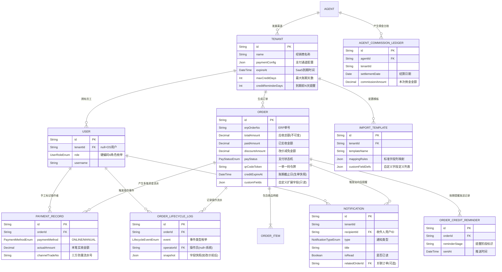

# 历史 Prisma 方案归档（V1）

> 归档日期：2026-04-11
> 文档状态：历史归档
> 说明：本文件为早期 Prisma / PostgreSQL 结构设计草案，保留用于回溯历史设计思路，不再作为当前数据建模依据。
> 当前生效的数据模型参考请以 `docs/prisma/data-model-reference.md` 为准。

# 经销商订单收款平台 - 核心数据库结构设计 (Prisma / PostgreSQL)

## 设计说明与规范

本套数据库设计采用 **PostgreSQL** 作为底层引擎，强绑定 **Prisma ORM** 的 `schema.prisma` 语法格式，生产级别立等可用。

1. **SaaS 多租户数据强隔离**: 所有产生业务数据的表均带有 `tenantId`，在 NestJS 中间件层强制全局注入租户上下文，实现行级强隔离。
2. **统一账号体系**: OS 用户与 Tenant 用户共用 `sys_user` 同一张表，以 `tenantId` 是否为空作为区分依据，硬编码 6 个预设角色枚举，不做动态角色自建。
3. **司机边界清晰**: 司机完全处于系统边界之外，无系统账号，`biz_order` 表以 `deliveryPersonName` 字符串字段记录送货人，满足报表溯源需求，不建立 FK 关联。
4. **全链路操作审计**: 新增 `biz_order_lifecycle_log` 操作流水表，覆盖打单、改价、支付确认（含区分 Webhook / 轮询 / 手工标记来源）等全部关键事件。
5. **软删除与金额防篡改**: 核心基础表带有 `createdAt / updatedAt / deletedAt`，`totalAmount` 一旦生单即不可更改，改价通过 `discountAmount` 字段承接，三者强恒等式约束财务对账。

---

## 一、核心系统级实体关系模型 (ER Diagram)



---

## 二、生产级别 `schema.prisma` 代码直出

**操作指引**：将以下代码整体拷贝进 `prisma/schema.prisma`，执行 `npx prisma db push`，底座即落盘 PostgreSQL。

### 第一部分：全局枚举定义

```prisma
// schema.prisma (PostgreSQL)
generator client {
  provider = "prisma-client-js"
}

datasource db {
  provider = "postgresql"
  url      = env("DATABASE_URL")
}

/// 统一角色枚举（OS端2个 + Tenant端4个，硬编码，不做动态自建）
/// tenantId = null 的用户只能持有 OS_* 角色
/// tenantId 有值的用户只能持有 TENANT_* 角色
enum UserRoleEnum {
  OS_SUPER_ADMIN    // OS平台超级管理员，仅由人工初始化创建
  OS_OPERATOR       // OS平台运营人员
  TENANT_OWNER      // 租户老板：全部模块 + 员工管理权
  TENANT_OPERATOR   // 打单员：导入、订单管理、打印中心
  TENANT_FINANCE    // 出纳：财务报表只读
  TENANT_VIEWER     // 只读：订单列表、财务报表只读
}

/// 订单支付状态机
enum PayStatusEnum {
  UNPAID        // 待支付
  PAYING        // 支付中（已唤起收银页，防并发重复发起）
  PARTIAL_PAID  // 部分到账
  PAID          // 全额收清
  REFUNDED      // 已退款
}

/// 订单配送状态机
enum DeliveryStatusEnum {
  PENDING      // 已打单，排车中
  IN_TRANSIT   // 司机已出车
  DELIVERED    // 已送达客户
}

/// 支付来源类型（区分真实扫码支付 vs 手工核销）
enum PaymentMethodEnum {
  ONLINE_PAYMENT  // 买家扫码，经拉卡拉支付通道完成
  MANUAL_MARKUP   // 员工手工标记已支付（线下转账、现金等场景）
}

/// 支付流水状态
enum PaymentRecordStatusEnum {
  SUCCESS   // 支付成功确认
  FAILED    // 支付异常/失败
  REFUNDED  // 已退款
}

/// 订单操作流水事件类型
enum LifecycleEventEnum {
  ORDER_CREATED              // 订单生成（Excel导入入库）
  ORDER_PRINTED              // 触发打印发货单
  PAYMENT_INITIATED          // 买家打开支付页，发起收银请求
  PAYMENT_SUCCESS_WEBHOOK    // 支付成功 —— 由拉卡拉 Webhook 回调确认
  PAYMENT_SUCCESS_POLLING    // 支付成功 —— 由前端重新获焦后主动轮询确认
  PAYMENT_MANUAL_MARKUP      // 手工标记已支付
  PRICE_ADJUSTED             // 金额调整（discountAmount 发生变更）
  ORDER_REFUNDED             // 订单退款
  QR_CODE_EXPIRED            // 二维码已过期，访问被拦截
  DELIVERY_STATUS_UPDATED    // 配送状态更新
}
```

---

### 第二部分：基础设施与账号权限域

```prisma
/// [业务推广域] 服务商 / 代理商
model Agent {
  id             String   @id @default(dbgenerated("gen_random_uuid()")) @db.Uuid
  name           String   @db.VarChar(100)
  contactPhone   String   @unique @db.VarChar(20)
  commissionRate Decimal  @default(0.00) @db.Decimal(5, 4) // 分润比例，用于月底算佣金

  tenants            Tenant[]
  commissionLedgers  AgentCommissionLedger[]

  createdAt  DateTime  @default(now())
  updatedAt  DateTime  @updatedAt
  deletedAt  DateTime?

  @@map("sys_agent")
}

/// [租户域] 商户主体（大B经销商实体）
model Tenant {
  id           String   @id @default(dbgenerated("gen_random_uuid()")) @db.Uuid
  agentId      String?  @db.Uuid  // 可选，若为代理商拉新则计入佣金台账
  name         String   @db.VarChar(100)
  contactPhone String   @db.VarChar(20)
  status       Int      @default(1)  // 1正常 0已封禁 2已过期

  // 支付通道进件配置：仅存公开参数（如商户号）
  // 私钥 / Secret 通过环境变量注入，禁止存入数据库
  paymentConfig Json?  @default("{}")

  expireAt  DateTime?  // SaaS 会员到期时间

  // —— 账期配置 ——
  maxCreditDays      Int  @default(30)  // 最大账期天数，租户可在系统内自主配置
  creditReminderDays Int  @default(3)   // 到期前几天触发站内信提醒（支持多阶段，见 3.6）

  agent           Agent?           @relation(fields: [agentId], references: [id])
  users           User[]
  orders          Order[]
  importTemplates ImportTemplate[]

  createdAt  DateTime  @default(now())
  updatedAt  DateTime  @updatedAt
  deletedAt  DateTime?

  @@map("sys_tenant")
}

/// [统一账号域] OS用户与Tenant用户共用同一张表
/// 区分规则：tenantId = null → OS端账号；tenantId 有值 → Tenant端员工账号
/// 角色枚举硬编码，不提供动态自建入口
model User {
  id           String       @id @default(dbgenerated("gen_random_uuid()")) @db.Uuid
  tenantId     String?      @db.Uuid  // OS账号此字段为 null
  username     String       @db.VarChar(50)
  passwordHash String       @db.VarChar(255)
  realName     String       @db.VarChar(50)
  role         UserRoleEnum // 6个预设枚举之一，后端硬编码权限映射
  status       Int          @default(1)  // 1可用 0冻结

  tenant        Tenant?              @relation(fields: [tenantId], references: [id])
  lifecycleLogs OrderLifecycleLog[]  // 该用户触发的操作流水（用于审计）
  manualPayments PaymentRecord[]     // 该用户手工标记的支付记录
  notifications  Notification[]      // 该用户收到的站内信

  createdAt  DateTime  @default(now())
  updatedAt  DateTime  @updatedAt
  deletedAt  DateTime?

  @@unique([tenantId, username])
  @@map("sys_user")
}

/// [基础设施域] Excel 导入字段映射模板
model ImportTemplate {
  id           String  @id @default(dbgenerated("gen_random_uuid()")) @db.Uuid
  tenantId     String  @db.Uuid
  templateName String  @db.VarChar(100)  // 如："某某酒水分部-金蝶K3导出模板"

  // 前端拖拽建立的列映射规则，序列化存储
  // 示例：{ "ERP订单号": "erpOrderNo", "客户名称": "customerName" }
  // 仅包含映射至系统标准字段的列，自定义字段由 customFieldDefs 单独声明
  mappingRules Json

  // 租户自定义扩展字段定义（可选），声明除标准映射外需要从 Excel 提取的额外列
  // 同一租户内建议统一 fieldKey 命名规范，以支持跨模板数据的一致性展示
  // 格式：[
  //   { "columnHeader": "内部备注", "fieldKey": "remark1", "label": "备注1", "showInList": true },
  //   { "columnHeader": "区域编号", "fieldKey": "remark2", "label": "区域",  "showInList": false }
  // ]
  // columnHeader: Excel 列头名（需与表格中实际列名一致）
  // fieldKey:     存入 biz_order.customFields 的 JSON key（英文标识，建议 remark1/remark2 等）
  // label:        前端列表列头显示名称
  // showInList:   true 时在订单列表（按模板筛选状态下）渲染为额外列
  customFieldDefs Json?  @default("[]")

  tenant  Tenant   @relation(fields: [tenantId], references: [id])
  orders  Order[]  // 通过该模板导入生成的订单，用于按供货商维度出报表

  createdAt  DateTime  @default(now())
  updatedAt  DateTime  @updatedAt

  @@map("biz_import_template")
}
```

---

### 第三部分：核心订单与支付流转域

```prisma
/// [核心流转域] 主订单表
model Order {
  id              String  @id @default(dbgenerated("gen_random_uuid()")) @db.Uuid
  tenantId        String  @db.Uuid
  erpOrderNo      String  @db.VarChar(100)  // 上游 ERP 单号
  customerName    String  @db.VarChar(100)  // 下游终端客户名（如：某某便利店）
  customerPhone   String? @db.VarChar(20)
  deliveryAddress String? @db.VarChar(255)

  // 送货人记录：司机完全在系统边界外，无账号，以字符串字段记录姓名即可
  // 用于财务报表按送货人统计维度，不建立 FK 关联
  deliveryPersonName String? @db.VarChar(50)

  // 关联导入模板，用于按供货商维度出财务报表
  templateId  String?  @db.Uuid

  // 导入时从模板 customFieldDefs 中提取的自定义扩展字段，生单后只读
  // 格式：{ "remark1": "A区重点客户", "remark2": "VIP" }
  // 字段键由对应模板的 customFieldDefs[].fieldKey 决定
  customFields  Json?  @default("{}")

  // —— 财务金额三元组（强恒等式：totalAmount = paidAmount + discountAmount）——
  totalAmount    Decimal  @db.Decimal(10, 2)             // 应收原始基线，生单后不可更改
  paidAmount     Decimal  @default(0.00) @db.Decimal(10, 2)  // 已实收入账金额
  discountAmount Decimal  @default(0.00) @db.Decimal(10, 2)  // 改价减免金额（如司机现场抹零）

  // —— 状态机 ——
  payStatus      PayStatusEnum      @default(UNPAID)
  deliveryStatus DeliveryStatusEnum @default(PENDING)

  // —— 一单一码令牌 ——
  // 仅存唯一 Hash 短串，不存完整 URL
  qrCodeToken  String    @unique @db.VarChar(64)
  qrExpireAt   DateTime  // 超过此时间访问时后端直接拦截，前端无法绕过

  // —— 账期截止日 ——
  // 生单时快照：= createdAt + tenant.maxCreditDays，写入后不可更改
  // 租户后续调整账期配置，不影响历史订单，符合财务合规要求
  creditExpireAt  DateTime

  tenant    Tenant          @relation(fields: [tenantId], references: [id])
  template  ImportTemplate? @relation(fields: [templateId], references: [id])
  items     OrderItem[]
  payments  PaymentRecord[]
  logs      OrderLifecycleLog[]
  creditReminders  OrderCreditReminder[]
  notifications    Notification[]

  createdAt  DateTime   @default(now())  // 即 ERP 导入生单时间
  updatedAt  DateTime   @updatedAt
  deletedAt  DateTime?  // 软删除，财务系统严禁物理删除

  @@unique([tenantId, erpOrderNo])  // 同一商家的相同单号不允许重复导入
  @@index([tenantId, payStatus])
  @@map("biz_order")
}

/// [订单明细域] 商品行项目（用于打印小票 / 展示给买家）
model OrderItem {
  id          String  @id @default(dbgenerated("gen_random_uuid()")) @db.Uuid
  orderId     String  @db.Uuid
  productName String  @db.VarChar(200)
  quantity    Int
  unitPrice   Decimal @db.Decimal(10, 2)
  amount      Decimal @db.Decimal(10, 2)  // 冗余字段：quantity * unitPrice，避免计算压力

  order  Order  @relation(fields: [orderId], references: [id], onDelete: Cascade)

  @@index([orderId])
  @@map("biz_order_item")
}

/// [支付流水域] 不可变资金流水，一单可多笔（分批付款 / 手工标记）
model PaymentRecord {
  id        String  @id @default(dbgenerated("gen_random_uuid()")) @db.Uuid
  orderId   String  @db.Uuid
  tenantId  String  @db.Uuid

  actualAmount  Decimal             @db.Decimal(10, 2)  // 本笔实际支付金额
  paymentMethod PaymentMethodEnum                        // 区分扫码支付 vs 手工标记

  // —— 线上支付专属字段（paymentMethod = ONLINE_PAYMENT 时有值）——
  channel        String?  @db.VarChar(50)      // 如：'LAKALA'
  channelTradeNo String?  @unique @db.VarChar(100)  // 三方网关支付单号，唯一约束防重复入账
  feeAmount      Decimal  @default(0.00) @db.Decimal(10, 2)  // 支付通道手续费
  rawCallbackData Json?                         // Webhook 原始回调报文，用于对账存档

  // —— 手工标记专属字段（paymentMethod = MANUAL_MARKUP 时有值）——
  operatorId  String?  @db.Uuid       // 执行标记操作的员工 ID
  markReason  String?  @db.VarChar(500)  // 标记原因（如：客户已现金付款/线下转账）

  status    PaymentRecordStatusEnum  @default(SUCCESS)
  paidTime  DateTime                 // 资金实际到账时间（Webhook告知 / 手工填写）

  order     Order  @relation(fields: [orderId], references: [id])
  operator  User?  @relation(fields: [operatorId], references: [id])

  createdAt  DateTime  @default(now())
  updatedAt  DateTime  @updatedAt

  @@index([orderId])
  @@map("biz_payment_record")
}

/// [审计溯源域] 订单全生命周期操作流水日志（不可变，只增不改）
/// 覆盖：生单、打印、发起支付、支付确认（区分来源）、手工标记、改价、退款等所有关键事件
model OrderLifecycleLog {
  id        String              @id @default(dbgenerated("gen_random_uuid()")) @db.Uuid
  orderId   String              @db.Uuid
  tenantId  String              @db.Uuid
  event     LifecycleEventEnum

  // 触发该事件的操作员；null 表示系统自动触发（如 Webhook 回调、定时轮询）
  operatorId  String?  @db.Uuid

  // 关键字段变更快照，用于事后溯源
  // 示例（改价事件）：{ "before": { "discountAmount": 0 }, "after": { "discountAmount": 300 } }
  // 示例（支付确认）：{ "source": "WEBHOOK", "channelTradeNo": "..." }
  snapshot  Json?

  remark  String?  @db.VarChar(500)  // 人工备注（手工标记时的原因说明）

  order     Order  @relation(fields: [orderId], references: [id])
  operator  User?  @relation(fields: [operatorId], references: [id])

  createdAt  DateTime  @default(now())  // 日志只增不改，无 updatedAt

  @@index([orderId])
  @@index([tenantId, event])
  @@map("biz_order_lifecycle_log")
}
```

---

### 第四部分：账期提醒域（Phase 2）

```prisma
/// 站内信通知类型枚举（预留扩展槽位）
enum NotificationTypeEnum {
  CREDIT_OVERDUE_REMINDER  // 账期即将到期提醒
  // 预留：PAYMENT_SUCCESS / SYSTEM_ANNOUNCEMENT 等
}

/// [账期提醒域] 站内信消息表
/// 收件人只推 TENANT_OWNER 与 TENANT_FINANCE 两个角色
/// 由 BullMQ 定时任务写入，不可被业务接口修改或删除
model Notification {
  id          String               @id @default(dbgenerated("gen_random_uuid()")) @db.Uuid
  tenantId    String               @db.Uuid
  recipientId String               @db.Uuid   // 收件人用户 ID（TENANT_OWNER / TENANT_FINANCE）
  type        NotificationTypeEnum
  title       String               @db.VarChar(200)
  content     String               @db.VarChar(1000)

  isRead  Boolean   @default(false)
  readAt  DateTime?

  // 关联订单，前端可点击跳转，null 表示非订单类系统通知
  relatedOrderId  String?  @db.Uuid

  order      Order?  @relation(fields: [relatedOrderId], references: [id])
  recipient  User    @relation(fields: [recipientId], references: [id])

  createdAt  DateTime  @default(now())

  @@index([recipientId, isRead])   // 核心查询：拉取某用户的未读消息列表
  @@index([tenantId, createdAt])
  @@map("sys_notification")
}

/// [账期提醒域] 账期提醒发送记录表（幂等控制）
/// BullMQ 每日定时任务写入前先 upsert 此表，同一订单同一阶段只推一次
/// reminderStage 示例值："7_DAYS_BEFORE" / "3_DAYS_BEFORE" / "1_DAY_BEFORE" / "EXPIRE_DAY"
model OrderCreditReminder {
  id       String  @id @default(dbgenerated("gen_random_uuid()")) @db.Uuid
  orderId  String  @db.Uuid
  tenantId String  @db.Uuid

  // 提醒阶段标识：同一订单同一阶段命中 @@unique 后静默跳过，天然幂等
  reminderStage  String    @db.VarChar(50)
  sentAt         DateTime  @default(now())

  order  Order  @relation(fields: [orderId], references: [id])

  @@unique([orderId, reminderStage])  // 唯一约束 = 幂等锁，重复执行直接报冲突跳过
  @@index([tenantId])
  @@map("biz_order_credit_reminder")
}
```

---

### 第五部分：代理商佣金台账域（Phase 2）

```prisma
/// [财务对账域] 代理商佣金日结台账
/// 由 BullMQ 定时任务每日凌晨生成，按 (agentId + tenantId + settlementDate) 唯一
model AgentCommissionLedger {
  id               String   @id @default(dbgenerated("gen_random_uuid()")) @db.Uuid
  agentId          String   @db.Uuid
  tenantId         String   @db.Uuid   // 该条台账归属的经销商
  settlementDate   DateTime @db.Date   // 结算日期（精确到天）

  totalOrderAmount  Decimal  @db.Decimal(12, 2)  // 当日该租户订单实收总额
  commissionRate    Decimal  @db.Decimal(5, 4)   // 快照：结算时的佣金比例（防后续比例调整影响历史数据）
  commissionAmount  Decimal  @db.Decimal(10, 2)  // 本次应付佣金金额
  status            Int      @default(0)          // 0待结算 1已结算

  agent  Agent  @relation(fields: [agentId], references: [id])

  createdAt  DateTime  @default(now())
  updatedAt  DateTime  @updatedAt

  @@unique([agentId, tenantId, settlementDate])
  @@index([agentId, status])
  @@map("biz_agent_commission_ledger")
}
```

---

## 三、核心设计决策说明

### 3.1 统一用户表 vs. 双表方案

OS 用户与 Tenant 用户共用 `sys_user` 表，`tenantId = null` 标识 OS 账号。统一鉴权中间件只需一套 JWT 解析和权限守卫逻辑，后端 `AuthModule` 代码量减少约 40%。

角色枚举固定 6 个值，在 NestJS 中通过 `@Roles()` 装饰器 + `RolesGuard` 硬编码权限映射，不提供动态配置界面，符合 Phase 1 MVP 从简原则。

### 3.2 司机边界与 `deliveryPersonName`

司机无系统账号，`biz_order.deliveryPersonName` 以字符串记录姓名，在经销商导入时从 Excel 映射列或手动填写。财务报表按送货人维度统计时，使用字符串 `GROUP BY`，满足基本需求；如 Phase 2 有更精细的司机考核诉求，可再升级为关联表，不影响现有结构。

### 3.3 金额三元组恒等式

```
totalAmount  =  paidAmount  +  discountAmount
```

`totalAmount` 在生单后只读，严禁 UPDATE。改价操作只写 `discountAmount`，每次写入同步在 `biz_order_lifecycle_log` 记录改价前后快照，确保财务对账可追溯。

### 3.4 支付双链路在流水日志中的区分

`PAYMENT_SUCCESS_WEBHOOK` 和 `PAYMENT_SUCCESS_POLLING` 两个事件枚举值，保证每一笔支付确认都记录了来源，方便排查掉单问题时直接查 `biz_order_lifecycle_log`，无需翻日志文件。

### 3.5 `channelTradeNo` 唯一约束防重复入账

### 3.6 账期提醒分阶段推送设计

账期提醒采用「配置驱动 + 幂等锁」双机制，核心设计如下：

**账期截止日快照原则**：`biz_order.creditExpireAt` 在生单时即写死（`createdAt + tenant.maxCreditDays`），租户后续修改账期天数不追溯历史订单，符合财务合规要求。

**多阶段提醒策略**：`reminderStage` 字符串标识提醒阶段，系统默认推三波：

```
到期前 7 天 → "7_DAYS_BEFORE"
到期前 3 天 → "3_DAYS_BEFORE"
到期当天    → "EXPIRE_DAY"
```

后续如需调整阶段数量，只需修改 BullMQ 任务逻辑，无需变更数据库结构。

**幂等执行流程**（BullMQ 每日凌晨定时触发）：

```
1. 查询满足条件的订单：payStatus IN [UNPAID, PARTIAL_PAID] AND creditExpireAt 在各阶段窗口内
2. 对每条订单 × 每个阶段，尝试插入 biz_order_credit_reminder
   - 插入成功 → 写入 sys_notification（推给 TENANT_OWNER + TENANT_FINANCE）
   - 唯一键冲突 → 静默跳过，本阶段已推过
3. 定时任务完全幂等，重复执行结果一致，无副作用
```

**收件人范围**：站内信固定推送给当前租户下所有 `TENANT_OWNER` 和 `TENANT_FINANCE` 角色用户，不推送给 `TENANT_OPERATOR` 和 `TENANT_VIEWER`。

拉卡拉因网络重试多次回调同一笔支付时，`PaymentRecord.channelTradeNo` 的 `@unique` 约束会在数据库层直接报唯一键冲突，Prisma 抛出异常，业务层 catch 后静默跳过，从物理层杜绝重复入账。手工标记的 `PaymentRecord` 此字段为 `null`，不受约束影响。
